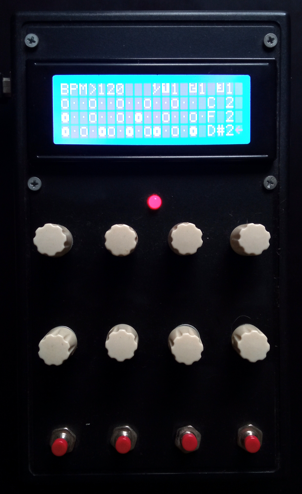

# Euclidean-step-sequencer
Euclidean step sequencer hardware.\
Based on my Luclydean vst plug-in (https://github.com/ezequielabregu/Luclydean)

<video src="media/euclidean_demo.mp4" controls="controls" style="width: 450px;">
</video>

&nbsp;

&nbsp;
### Features:
* 3 channels
* MIDI note selector
* 16 steps sequencer
* Hits, rotation and accent controls
* BPM sync with the DAW
* Clock devider
* 20x4 Display
* 12 encoders
* 4 buttons
* MIDI out

